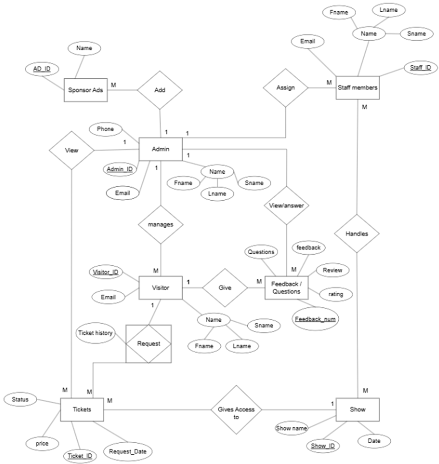
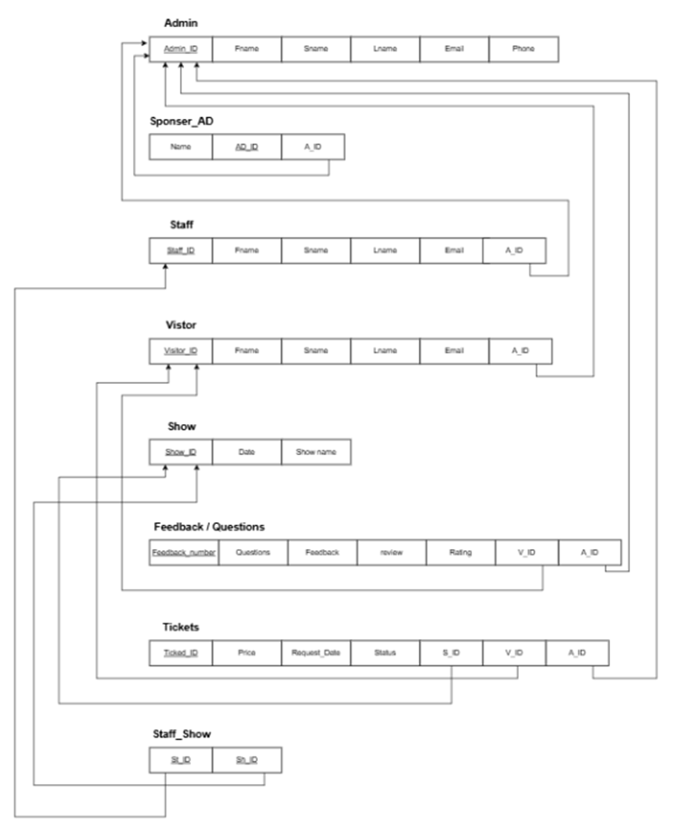
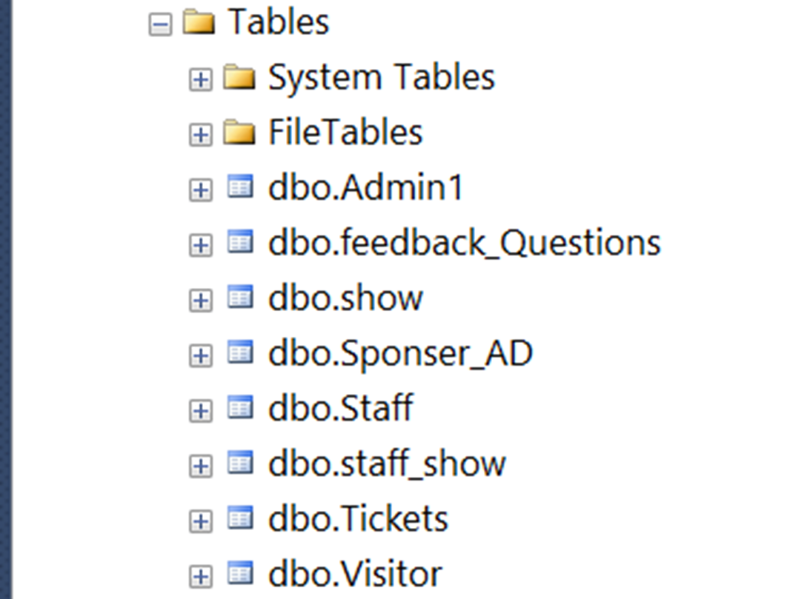

# Event_Management_System
A Java Swing application with SQL Server integration for managing event administration, staff, visitors, shows, tickets, and feedback. Features a tabbed GUI interface with CRUD operations for all entities.

<div style="text-align: center;">
  
</div>


# 📌 Features
*1. Comprehensive Entity Management*

1. Admin Panel: Manage administrator accounts

2. Sponsor Panel: Handle event sponsors

3. Staff Panel: Organize event staff members

4. Visitor Panel: Track event attendees

5. Show Panel: Schedule and manage events

6. Feedback Panel: Collect and view visitor feedback

7. Ticket Panel: Process ticket requests

8. Staff-Show Panel: Assign staff to events

*2. Database Operations*
1. SQL Server integration (JDBC)

2. CRUD operations for all entities

3. Data validation with error handling

*3. User Interface*
1. Tabbed interface for easy navigation

2. Form-based input for each entity

3. Text area output displaying operation results

*🛠️ Technologies Used*
1. Java Swing (GUI)

2. JDBC (SQL Server connectivity)

3. MSSQL (Database backend)

4. OOP Principles (Encapsulation, Inheritance, Polymorphism)

---

# 🚀 Getting Started

*Prerequisites*

1. Java JDK 8+

2. SQL Server with database 

3. Integrated Windows Authentication enabled

---

# Running the Application

*Clone the repository*

    git clone https://github.com/AhmedAdelMohamedAbouhussein/Event_Management_System.git

*Compile:*
```
javac MAIN22.java
```

*Run:*
```
java MAIN22
```

---

# 📂 Project Structure

```
MAIN22.java                 # Main application class
  ├── Admin Panel           # Admin management
  ├── Sponsor Panel         # Sponsor management  
  ├── Staff Panel           # Staff management
  ├── Visitor Panel         # Visitor management
  ├── Show Panel            # Event management
  ├── Feedback Panel        # Feedback handling
  ├── Ticket Panel          # Ticket processing
  └── Staff-Show Panel      # Staff assignment
```

---

# 🔍 Code Highlights
*1. Database Connection:*

    String url = "jdbc:sqlserver://localhost\\MSSQLSERVERR:1433;DatabaseName=12th_final;integratedSecurity=true;"

*2. Tabbed Interface:*

    JTabbedPane tabbedPane = new JTabbedPane();

    tabbedPane.addTab("Admin", createAdminPanel());

*3. CRUD Operations:*

    // Example: Add Admin
    String sql = "INSERT INTO Admin1 VALUES (?, ?, ?, ?, ?, ?)";

# ERD / RDM / DB Schema
*ERD*
<div style="text-align: center;">
  
</div>

*RDM*
<div style="text-align: center;">
  
</div>

*DB Schema*
<div style="text-align: center;">
  
</div>

# GUI Pictures

<div style="text-align: center;">
  
</div>

<div style="text-align: center;">
  
</div>

<div style="text-align: center;">
  
</div>

<div style="text-align: center;">
  
</div>

<div style="text-align: center;">
  
</div>

<div style="text-align: center;">
  
</div>

<div style="text-align: center;">
  
</div>